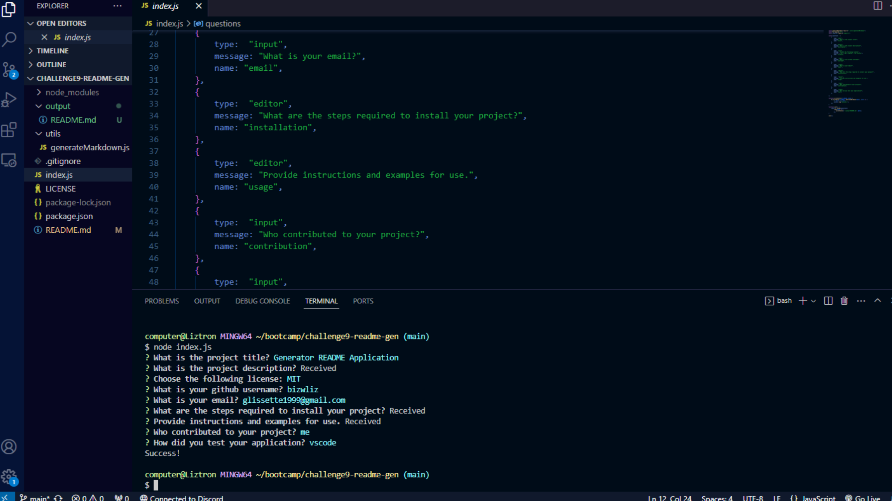

# Challenge 9 README Generator

## Description
In this challenge, I will be creating a README Generator using Node. The terminal will prompt a series of questions once the user runs "node index.js", these questions will take the information provided by the user and once completed will generate a readme file in the output folder.

## Installation
<ol>
    <li>Create Repository on Github</li>
    <li>Clone Repository to Computer and open in VS Code</li>
    <li>Install Node Modules</li>
    <li>Create Output folder</li>
    <li>Create generatormarkdown.js to define data for each section in the readme</li>
    <li>Create functions in index.js</li>
    <li>Create README.md file using node in terminal</li>
    <li>Deploy link via github and submit in bootcamp</li>
</ol>

## Credits
<ol>
    <li><a href="https://gist.github.com/lukas-h/2a5d00690736b4c3a7ba">Markdown License Badges</a></li>
    <li><a href="https://coding-boot-camp.github.io/full-stack/github/professional-readme-guide">Professional README Guide</a></li>
    <li><a href="https://opensource.org/license/">Open Source License</a></li>
</ol>

## Usage

Link to github: <a href="https://github.com/bizwliz/challenge9-readme-gen">Challenge 9 Github</a>

Video Demonstration: 

## License
 

## Tests
Tested using VS Code.